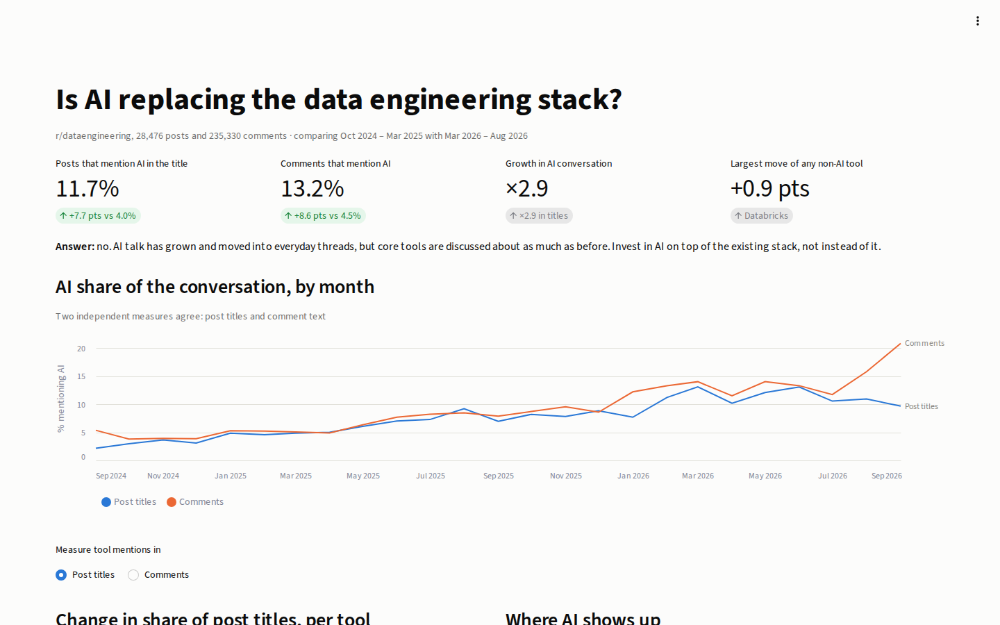
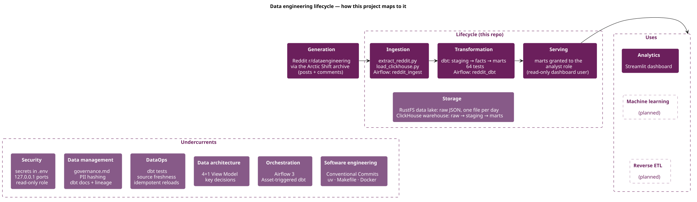
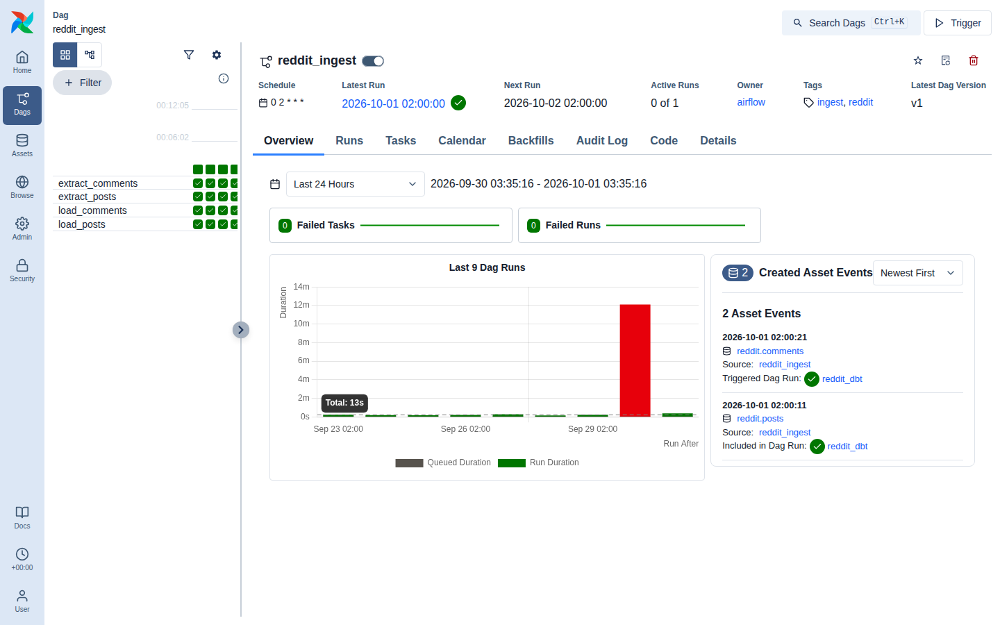
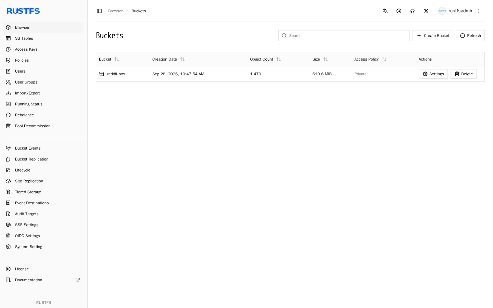
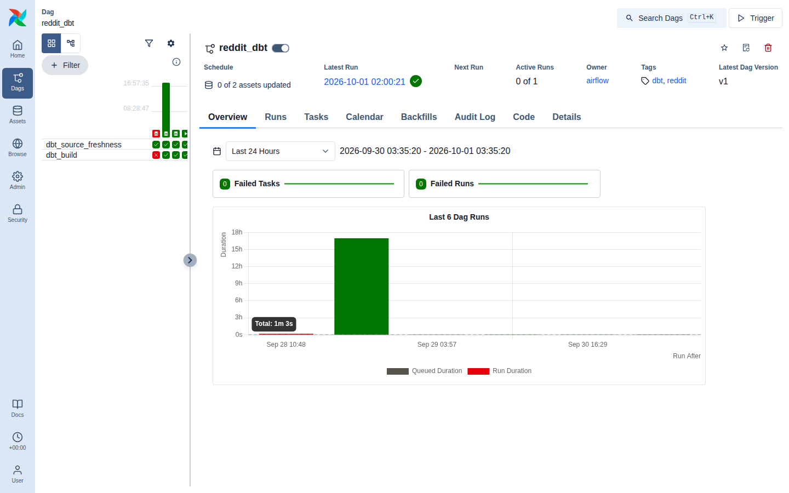
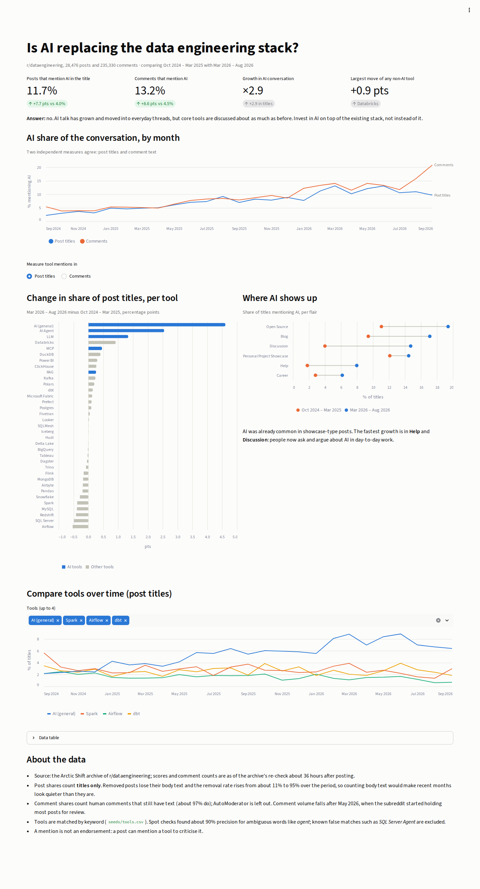

# Reddit Data Engineering

An end-to-end data project on two years of r/dataengineering posts and comments (Sep 2024 – Sep 2026),
built step by step following the ODT internal bootcamp.

**Question:** Is AI replacing the data engineering stack?
**Answer:** No. Posts with an AI tool in the title went from 4.0% to 11.7% (×2.9), and comments
that mention AI went from 4.5% to 13.2% (also ×2.9). AI spread into Help and Discussion, but no
non-AI tool moved more than 0.9 points in titles, so AI is being added on top of the existing
stack, not replacing it.

## Architecture

Python · Airflow 3 · RustFS (S3) · ClickHouse · dbt · Streamlit · Docker Compose · PlantUML

| Component | Role | Local URL |
|---|---|---|
| Arctic Shift | Archive of Reddit posts and comments, the data source | — |
| RustFS | S3 data lake: raw JSON, one file per day and kind | http://localhost:9001/rustfs/console/ |
| ClickHouse | Warehouse: raw tables, dbt staging views and mart tables | http://localhost:8123 |
| Airflow | Daily `reddit_ingest` DAG and the Asset-triggered `reddit_dbt` DAG | http://localhost:8082 |
| dbt | Staging, facts and marts, the `tools` seed and 64 tests | `make dbt-docs` → http://localhost:8081 |
| Streamlit | Dashboard, reading marts as the read-only `dashboard` user | http://localhost:8501 |

The full design is in the [4+1 View Model](docs/architecture/).

### Data engineering lifecycle

The project follows the data engineering lifecycle from *Fundamentals of Data Engineering*
(Reis & Housley): data moves from generation through ingestion, transformation and serving, on
top of storage, and every stage leans on the same undercurrents.

| Stage | In this project | Where |
|---|---|---|
| Generation | Reddit r/dataengineering posts and comments, read through the Arctic Shift archive | [`scripts/extract_reddit.py`](scripts/extract_reddit.py) |
| Ingestion | Daily batch: extract a day to RustFS, then ClickHouse loads it with `s3()`; idempotent and backfillable | [`scripts/`](scripts/), [`reddit_ingest`](airflow/dags/reddit_ingest.py) |
| Storage | RustFS data lake (raw JSON, one file per day) and ClickHouse warehouse (raw → staging → marts) | [`docker-compose.yml`](docker-compose.yml), [`scripts/create_tables.sql`](scripts/create_tables.sql) |
| Transformation | dbt staging, facts and marts, a `tools` seed and 64 tests; the comparison windows and every share the dashboard shows are computed here; runs when both raw tables have new data | [`dbt/reddit/`](dbt/reddit/), [`reddit_dbt`](airflow/dags/reddit_dbt.py) |
| Serving | Marts granted to a read-only `analyst` role | [`scripts/create_users.sh`](scripts/create_users.sh) |
| Analytics | Streamlit dashboard for a DE lead; it only selects from marts, no calculations of its own | [`dashboard/`](dashboard/) |
| Machine learning | Not covered yet | — |
| Reverse ETL | Not covered yet | — |

| Undercurrent | In this project |
|---|---|
| Security | Secrets only in `.env`, services bound to 127.0.0.1, read-only dashboard user |
| Data management | [Governance](docs/governance.md): pseudonymised usernames, PII tags, dbt docs and lineage, known data limits, raw-bucket backup and restore |
| DataOps | dbt tests, source freshness gate, retries with backoff, idempotent reloads, raw-bucket backup, and CI that runs the whole pipeline on fixtures |
| Data architecture | [4+1 View Model](docs/architecture/) and key decisions |
| Orchestration | Airflow 3: a daily ingest DAG and an Asset-triggered dbt DAG |
| Software engineering | Conventional Commits, uv projects, Makefile, Docker Compose, pinned image versions, ruff and pytest |

## Features

- **Two years of history:** about 28k posts and 235k comments, backfilled from the archive and
  kept up to date by a daily run.
- **Idempotent ingestion:** every day can be re-extracted and reloaded without duplicates.
- **Event-driven transformation:** `reddit_dbt` runs when both raw tables have new data, and a
  source freshness check stops it on stale data.
- **Tested models:** 64 dbt tests, unit tests for the scripts, and CI that runs the whole
  pipeline on synthetic fixtures.
- **Governed serving:** usernames are pseudonymised and the dashboard can read marts only.
- **Story-first dashboard:** every number on it is computed in dbt.

## Getting started

### Prerequisites

- [Docker](https://docs.docker.com/get-docker/) with Compose (give it at least 4 GB of memory)
- [uv](https://docs.astral.sh/uv/) for the Python scripts and dbt
- `make`

### Step 1 — Get the code

    git clone https://github.com/modsomjeed/reddit-dataeng.git
    cd reddit-dataeng

### Step 2 — Create your `.env`

    make setup

This copies `.env.example` to `.env`. Open `.env` and replace every `change-me` value
(ClickHouse, the read-only dashboard user, RustFS, and `PII_HASH_SALT`).

### Step 3 — Start the services

    make up

This builds the Airflow and dashboard images and starts ClickHouse, RustFS, Airflow and the
dashboard. On first start ClickHouse creates the raw table, the `analyst` role and the
`dashboard` user. `make ps` shows status and URLs at any time.

### Step 4 — Load two years of posts and comments

    make backfill                  # posts: Arctic Shift → RustFS, one file per day
    make backfill KIND=comments    # comments: about 250k, the first run takes a few hours
    make load                      # posts: RustFS → ClickHouse raw table
    make load KIND=comments        # comments: RustFS → ClickHouse raw table
    make dbt-build                 # staging, facts and marts, plus 64 tests

Every step is safe to rerun: `backfill` skips days already in RustFS, `load` doesn't create
duplicates, and dbt rebuilds the models. Use `make backfill START=2026-09-01 END=2026-09-24`
for a shorter range. `make bootstrap` runs steps 2–4 in one go.

When the backfill is done, the `reddit-raw` bucket holds one file per day for posts and comments:

### Step 5 — Look at the results

| What | Where |
|---|---|
| Dashboard | http://localhost:8501 |
| Airflow (airflow / airflow) | http://localhost:8082 (`AIRFLOW_PORT` in `.env`) — unpause `reddit_ingest` (daily at 02:00 UTC) and `reddit_dbt` (runs after each ingest) |
| RustFS console | http://localhost:9001/rustfs/console/ (RustFS keys from `.env`) |
| dbt docs and lineage | `make dbt-docs`, then http://localhost:8081 |

After each ingest run, `reddit_dbt` checks source freshness and then runs `dbt build`. The red
bar is an early failed run; the runs after it passed:

`make screenshots` captures these images again from the running stack.

### All commands

Run `make` (or `make help`) to list them:

| Command | What it does |
|---|---|
| `make setup` | Create `.env` from `.env.example` (never overwrites an existing `.env`) |
| `make up` | Build images and start every service, then show status and URLs |
| `make down` | Stop every service (data volumes are kept) |
| `make ps` | Show service status and URLs |
| `make logs SERVICE=…` | Follow logs, e.g. `SERVICE=airflow-scheduler` |
| `make backfill [KIND=… START=… END=…]` | Extract posts (default) or comments to RustFS for a date range (default: the full two years) |
| `make backup-raw` | Copy the raw bucket to `data/backup/` (new or changed files only) |
| `make restore-raw` | Upload files from `data/backup/` that the raw bucket is missing |
| `make load [KIND=…]` | Load every raw posts (default) or comments file from RustFS into ClickHouse |
| `make lint` | Lint the Python code with ruff |
| `make test` | Run the unit tests |
| `make dbt-build` | Build and test all dbt models |
| `make dbt-docs` | Generate dbt docs and serve them on port 8081 |
| `make bootstrap` | First run: `setup`, `up`, backfill and load posts and comments, then `dbt-build` |
| `make ingest-test DAY=…` | Run the `reddit_ingest` DAG once for one day (extract and load only) |
| `make dbt-test` | Run the `reddit_dbt` DAG once (source freshness, then dbt build) |
| `make screenshots` | Capture the README screenshots from the running stack into `docs/images/` |
| `make diagrams` | Render the PlantUML architecture diagrams to SVG |

## Design decisions

| Decision | Why |
|---|---|
| Arctic Shift instead of the Reddit API | The Reddit API stops at about 1,000 items per listing and can't query by date, so it can't provide a 2-year backfill. |
| RustFS instead of MinIO | MinIO's Docker images can no longer be pulled. RustFS speaks the same S3 API. |
| ClickHouse reads the bucket with `s3()` | Load becomes a single SQL statement (ELT), with no row handling in Python. |
| `ReplacingMergeTree` on the raw tables | Reloading a day adds no duplicates; staging reads it with `FINAL`. |
| Ingestion and dbt in separate, Asset-linked DAGs | Backfills don't force a dbt rebuild per day; dbt runs when both raw tables have new data. |
| Trends use title-only mentions | Removed posts lose their body, and the removal rate rises from about 11% to 95%, so body text would bias later months downwards. |

More decisions are in the [architecture docs](docs/architecture/README.md#key-decisions).

## Business questions and dashboard metrics

The dashboard is for a data engineering lead planning the team's stack and skills for next year
([story](docs/dashboard/story.md)).

| Question | Metric on the dashboard | dbt model |
|---|---|---|
| How much of the conversation is about AI now? | AI share of post titles and of comments, latest window vs first | `mart_ai_share_change` |
| Is it a trend or a spike? | AI share by month, titles and comments | `mart_ai_share_by_month` |
| Are other tools losing ground? | Change in share per tool, in points | `mart_tool_share_change` |
| Where does AI come up? | AI share of titles per flair, first vs latest window | `mart_ai_share_by_flair_window` |
| How does a tool I care about compare? | Monthly share of up to four chosen tools | `mart_tool_mentions_by_month`, `mart_comment_tool_mentions_by_month` |
| Which months are compared? | First and latest six-month windows | `dim_comparison_windows` |

## Verification and limitations

As of 2026-10-01 the warehouse holds 28,476 posts and 235,330 comments from 2024-09-25 onwards,
the daily DAGs are running, and all 64 dbt tests pass.

- **Keyword matching:** tools are matched by keyword ([`tools.csv`](dbt/reddit/seeds/tools.csv)).
  Spot checks found about 90% precision for ambiguous words like *agent*; known false matches
  such as *SQL Server Agent* are excluded.
- **Removed posts:** the removal flag is captured seconds after posting, and later removals are
  right-censored. See [governance](docs/governance.md#known-data-limitations).
- **Comment volume** falls after May 2026, when the subreddit started holding most posts for review.
- **A mention is not an endorsement:** a post can mention a tool to criticise it.

## Tests and CI

    make lint    # ruff
    make test    # unit tests for the extract, load and backup scripts (no network)

[GitHub Actions](.github/workflows/ci.yml) runs two jobs on every push and pull request to `main`:

| Job | What it does |
|---|---|
| Lint and unit tests | `ruff check` and `pytest` |
| Pipeline end to end | Starts ClickHouse and RustFS as service containers, creates the tables and the read-only user, uploads the synthetic fixtures in [`tests/fixtures/`](tests/fixtures/) to the bucket, loads them with the real loader, runs `dbt build` (all 64 tests, with one-month comparison windows to fit the four months of fixtures) and then checks the marts with `pytest -m e2e` |

The fixtures are made up, not real Reddit data. They cover the cases that broke once: multi-word
tool names, "SQL Server Agent" not counting as an AI agent, removed and held posts, AutoModerator
comments and deleted accounts.

## What's inside

| Path | What |
|---|---|
| `scripts/` | Extract from Arctic Shift to RustFS; load into ClickHouse with `s3()`; ClickHouse init scripts |
| `airflow/` | Custom image (Airflow + dbt), the `reddit_ingest` DAG and the Asset-triggered `reddit_dbt` DAG |
| `dbt/reddit/` | Staging, facts and marts for posts and comments (including the dashboard's comparison marts), the `tools` seed, macros and 64 tests |
| `dashboard/` | Streamlit dashboard for a DE lead, reading the marts as the read-only `dashboard` user |
| `tests/` | Unit tests, synthetic fixtures and end-to-end checks |
| `.github/workflows/` | CI: lint, unit tests and the pipeline end to end |
| `docs/architecture/` | 4+1 View Model (PlantUML) |
| `docs/images/` | README screenshots, captured by `make screenshots` |
| `docs/dashboard/story.md` | User, empathy map, GAME and SCQA, designed before the dashboard |
| `docs/governance.md` | PII, access control, freshness and known data limits |

## Bootcamp coverage

| Topic | Status |
|---|---|
| Thinking with Data | ✅ questions at four analytics levels; main theme chosen |
| Data Engineering 101 + Architecture | ✅ source evaluation, data lake + warehouse, ELT, 4+1 views |
| Data Pipelines with Airflow | ✅ daily DAG, idempotent reloads, backfill, retries, freshness check |
| Analytics Engineering with dbt | ✅ staging / mart layers, seed, generic, singular and grain tests, docs |
| Data Governance | ✅ pseudonymised usernames, read-only analyst role, data limits |
| Dashboard Design + Data Product | ✅ story-first Streamlit dashboard |
| Machine Learning · Kafka · Agentic AI + RAG | ⏸ not covered yet |

## Reflection

### 1. What did you learn from this project?

- **Check the source before designing anything.** The Reddit API couldn't give two years of
  history, so the project runs on the Arctic Shift archive, and that archive's own rules later
  shaped the whole analysis.
- **Idempotency is what makes a pipeline safe to rerun.** A `ReplacingMergeTree` raw table,
  `--force` re-extracts and retries with backoff let me backfill and rerun days without
  duplicates, even when the archive returned errors partway through.
- **Framework defaults can be wrong for your data.** In Airflow 3 a plain cron schedule sets
  `ds` to the run date, so the first runs extracted a day that had only just started. Switching
  to `CronDataIntervalTimetable` fixed it.
- **Tests catch bugs you would never see by eye.** dbt-clickhouse loads empty seed cells as `''`
  rather than NULL, which silently broke multi-word tools like "Power BI". A test now guards it.
- **Question the number before telling the story.** Spark looked like it was falling 4 points,
  but removed posts lose their body text; counting titles only, the drop was 0.4 points.
- **An archive's API has its own limits.** Comment searches timed out whenever the time window
  was narrow, and only probing different query shapes showed it; widening the window to a week
  fixed it without losing a single comment.
- **Definitions are governance.** "Removed" meant two different things in the data, and two
  moderator rule changes explained most of the rise. Writing that down mattered as much as the code.

### 2. How would you improve it?

- Use the **comments** for more questions: time to first answer on Help posts, the best time to
  post, and what the community recommends.
- Replace keyword matching with a better classifier, and measure precision on a labelled sample
  instead of spot checks.
- **Re-extract older days** after a few weeks to catch later removals (today they are
  right-censored), and move the facts to **incremental** dbt models.
- Add **alerting** on failed DAG runs.
- Keep the hashing salt out of the staging view DDL (for example with a materialised table).
- Finish the remaining topics: topic modelling (ML), a streaming path with Kafka, and RAG over the
  posts.

### 3. If you have to do it all over again, what would you do it differently?

- **Read the source's field semantics on day one.** I only found out late that the removal flag
  is captured seconds after posting and that later removals live in `_meta`.
- **Choose the fair metric (titles only) before building marts**, not after spotting a
  misleading trend.
- **Set up tests and CI with the first model**, not after the first bug.
- **Check infrastructure choices early**: MinIO's images had stopped being published, and the
  compose project name clashed with another branch's stack.
- **Draw the 4+1 views early and update them as I go**, instead of catching up after each step.
