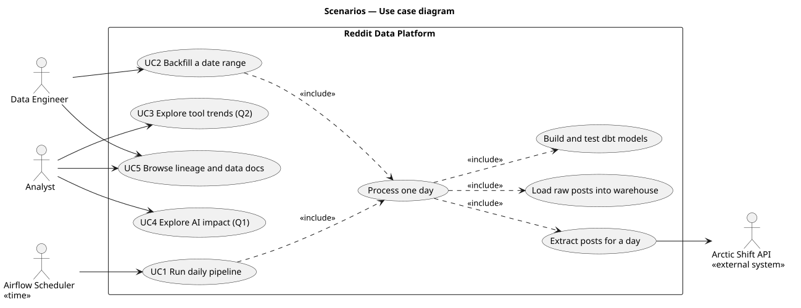
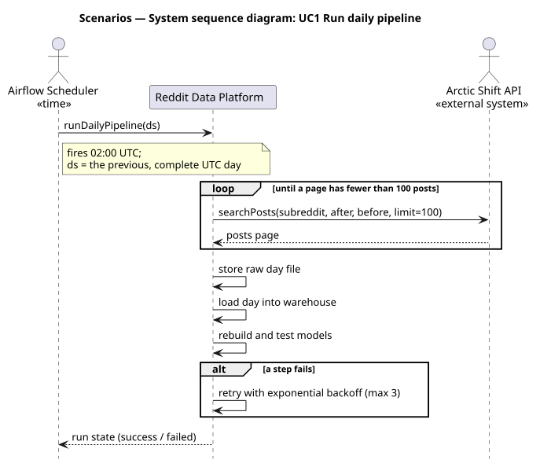
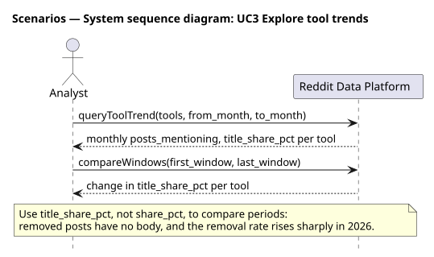
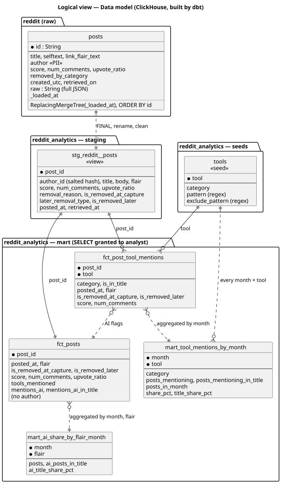
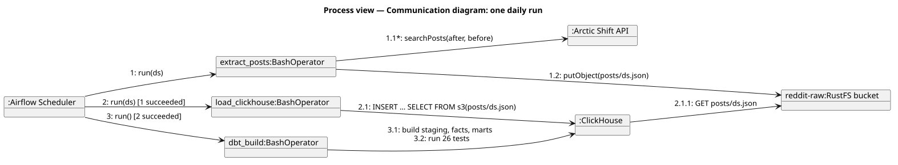
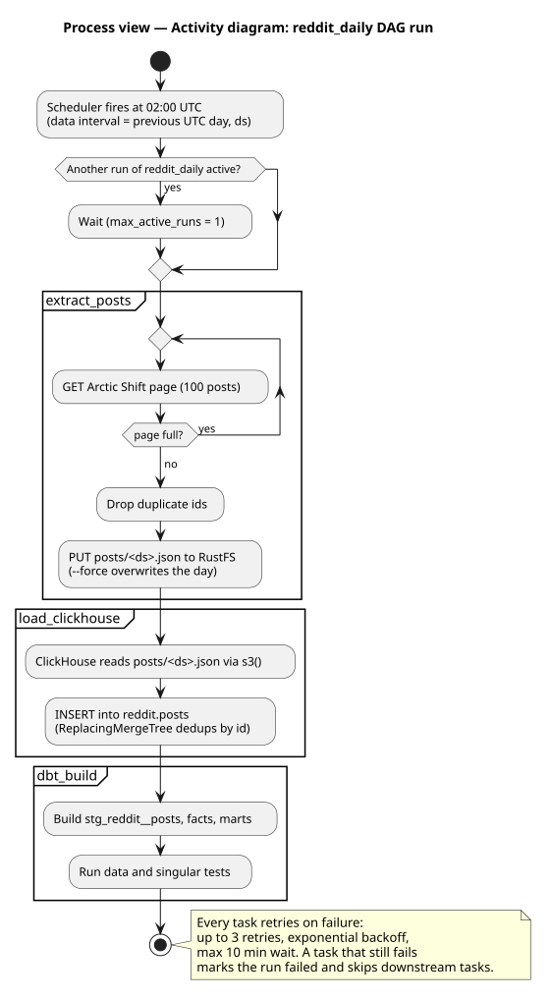
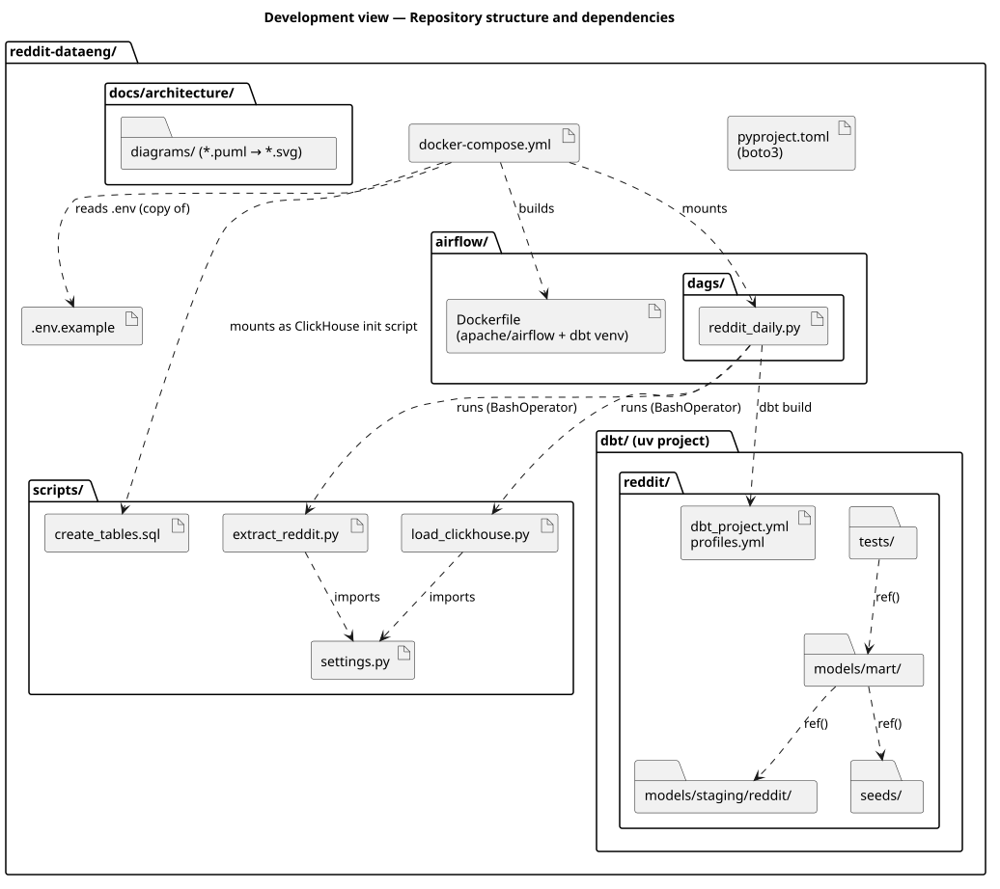
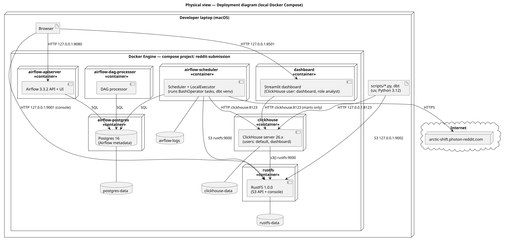

# Architecture — 4+1 View Model

Reddit posts from r/dataengineering flow through a daily ELT pipeline:

Arctic Shift API → RustFS (raw JSON) → ClickHouse (raw table) → dbt (staging → marts), orchestrated by Airflow.

Diagrams are written in PlantUML (`diagrams/*.puml`) and rendered to SVG with `make diagrams`.

## +1 Scenarios

Who uses the platform and what they do with it. The Airflow scheduler runs the
daily pipeline; a data engineer backfills date ranges; an analyst explores tool
trends and the impact of AI. Every pipeline run processes one day: extract, load,
build and test.

The system sequence diagrams treat the platform as a black box and show only the
messages that cross its boundary.

## Logical view

The data model. Raw posts land in `reddit.posts`; dbt cleans them into
`stg_reddit__posts`, matches them against the `tools` seed to build
`fct_post_tool_mentions` (one row per post and tool), and aggregates into monthly
marts. `fct_posts` and the marts carry no usernames.

## Process view

What happens at runtime during one daily run: which component calls which, and in
what order. Airflow runs one DAG run at a time; each task retries with exponential
backoff.

## Development view

How the code is organised: Python scripts for extract and load, the Airflow DAG
that runs them, and the dbt project with its staging, mart, seed and test folders.

## Physical view

Where it runs: six containers in one Docker Compose project on a laptop, with
named volumes for data. Only Airflow, the RustFS API and console, and ClickHouse
are exposed, and only on 127.0.0.1.

## Key decisions

| Decision | Why |
|---|---|
| Arctic Shift instead of the Reddit API | The Reddit API needs OAuth, stops at about 1,000 items per listing and can't query by date, so it can't provide a 2-year backfill. |
| RustFS instead of MinIO | MinIO's Docker images can no longer be pulled. RustFS speaks the same S3 API. |
| ClickHouse reads the bucket with `s3()` | Load becomes a single SQL statement (ELT), with no row handling in Python. |
| `ReplacingMergeTree` on the raw table | Reloading a day adds no duplicates; staging reads it with `FINAL`. |
| `CronDataIntervalTimetable` in Airflow | Airflow 3's plain cron schedule sets `ds` to the run date, so a 02:00 run would extract an unfinished day. |
| Trends use title-only mentions | Removed posts lose their body, and the removal rate rises from about 11% to 95%, so counting body text would bias later months downwards. |
