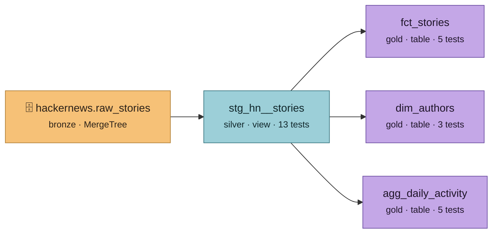

# Lineage — จาก Hacker News ถึง dashboard

> สร้างอัตโนมัติด้วย `make docs-gen` — อย่าแก้ไฟล์นี้ด้วยมือ

## อ่านกราฟนี้ยังไง

| ชั้น | สี | ทำอะไร |
|---|---|---|
| **bronze** `hackernews.raw_stories` | ส้ม | landing zone — หน้าตาเหมือนที่ Algolia ส่งมา append อย่างเดียว เก็บทุก snapshot |
| **silver** `stg_hn__stories` | ฟ้า | ยุบเหลือ snapshot ล่าสุดต่อ story + ถอด HTML + คำนวณ field ช่วยวิเคราะห์ |
| **gold** marts | ม่วง | ตารางที่ธุรกิจใช้จริง จัดแบบ Kimball (fact + dimension) + ตาราง aggregate สำหรับ dashboard |

ทุก mart อ่านจาก `stg_hn__stories` ตัวเดียว ไม่มี mart ไหนแตะ `raw_stories` ตรงๆ
นั่นคือเหตุผลที่ dedup ทำที่เดียวแล้วทั้งระบบได้ประโยชน์

## ทำไม mart ไม่ `ref()` กันเอง

แต่ละ mart มี grain ของตัวเอง (1 story / 1 author / 1 วัน) ถ้าให้ `agg_daily_activity`
อ่านจาก `fct_stories` จะประหยัดได้นิดหน่อย แต่ผูกสองตารางเข้าด้วยกันโดยไม่จำเป็น —
แก้ `fct` ทีเดียว `agg` พังตาม ตอนนี้ทั้งคู่ขึ้นกับ staging เท่านั้น และมี singular test
`assert_daily_activity_reconciles_with_fct` คอยยืนยันว่าตัวเลขสองทางตรงกัน

## สถิติ ณ ตอน generate

- 4 models · 1 source · **28 tests**
- ดูฉบับโต้ตอบ: `make dbt-docs` แล้วเปิด `dbt/target/index.html`
